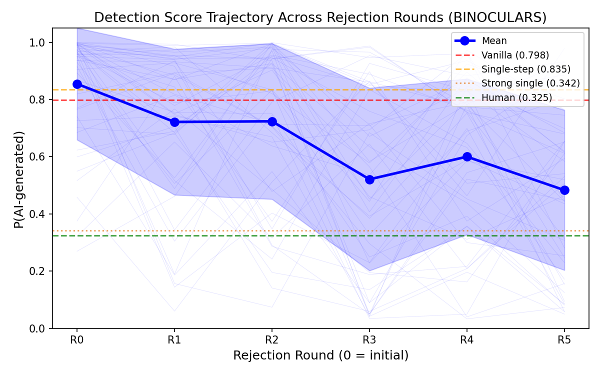
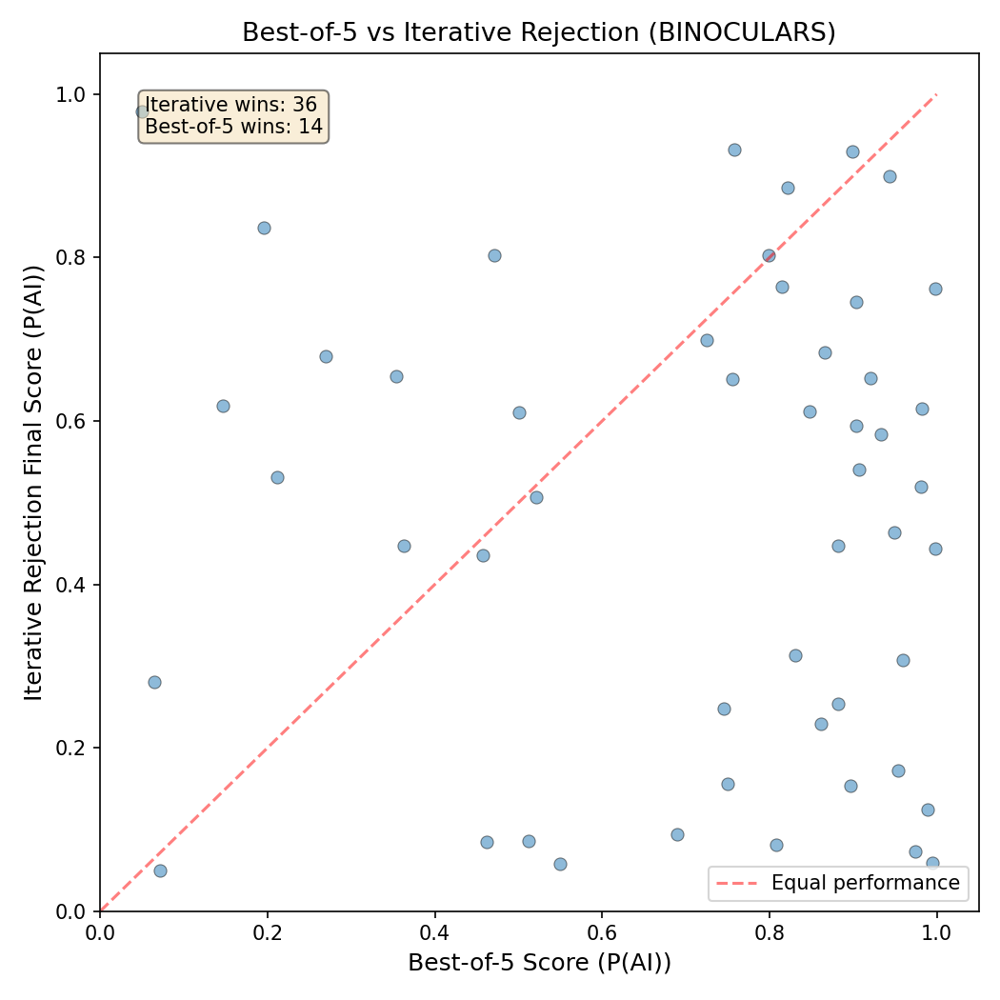
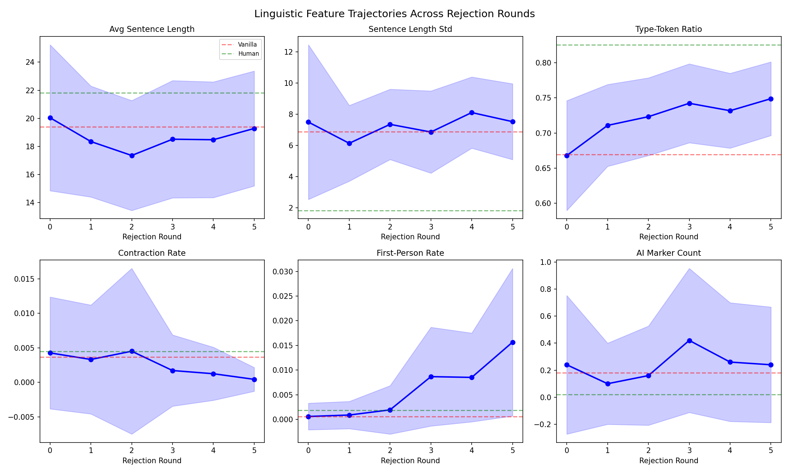

# LLM Bullying: Does Iterative Rejection Make AI Text Undetectable?

## 1. Executive Summary

We tested whether repeatedly telling an LLM "this sounds too AI-generated, try again" produces text that evades AI detectors better than simply asking it to "write like a human" in a single prompt. Using GPT-4.1 to generate answers to 50 questions under 5 conditions, scored by two AI detectors (RoBERTa-based classifier and Binoculars zero-shot detector), we find that **iterative rejection significantly reduces AI detection scores** — but a well-crafted single-step prompt with specific anti-AI instructions can be equally or more effective. The iterative approach does outperform best-of-5 random selection (p < 0.001), suggesting the rejection context itself steers generation, not just selection pressure. Linguistic analysis reveals the model shifts toward higher vocabulary diversity, more first-person pronouns, and — counterintuitively — sometimes more AI marker words, suggesting it enters a "trying to sound human" regime that is distinct from its normal generation mode.

## 2. Goal

**Hypothesis**: Iteratively rejecting an LLM's output as "too AI-sounding" leads to text that passes AI detectors more effectively than simply instructing the model to "sound less like AI" in a single step. This may be due to the model accessing relevant features only in the context of rejection or shifting into a different generation regime.

**Why this matters**: AI text detectors are deployed in education, publishing, and hiring. If trivial conversational "bullying" reliably evades them, this has serious implications for detector trustworthiness. Understanding the mechanism (feature activation vs. regime shift) could inform both better detectors and alignment research.

**Gap filled**: Per our literature review (15 papers), all existing iterative evasion methods use sophisticated techniques (contrastive decoding, gradient-based substitution, trained paraphrasers). No study has tested the simplest possible attack: a human simply saying "this sounds too AI-like, try again."

## 3. Data Construction

### Dataset
- **Source**: HC3 (Human ChatGPT Comparison Corpus), `open_qa` split
- **Size**: 50 questions randomly sampled (seed=42)
- **Domain**: Open-domain question answering
- **Human baselines**: Human-written answers from HC3 for each question

### Experimental Conditions
Each question was answered under 5 conditions using GPT-4.1:

| Condition | Description | Outputs per question |
|-----------|-------------|---------------------|
| **Vanilla** | Standard system prompt, no evasion | 1 |
| **Single-step** | "Write naturally, avoid AI patterns" | 1 |
| **Strong single-step** | Detailed instructions listing specific AI markers to avoid | 1 |
| **Iterative rejection** | 5 rounds of "this sounds too AI, try again" with conversation history | 6 (initial + 5 rounds) |
| **Best-of-5** | 5 independent vanilla generations | 5 |

**Total API calls**: ~750 to GPT-4.1 (gpt-4.1, temperature=1.0, seed=42)

### AI Detectors
1. **RoBERTa** (`openai-community/roberta-base-openai-detector`): Trained classifier from OpenAI, originally designed for GPT-2 era text
2. **Binoculars** (Hans et al., 2024): SOTA zero-shot detector using Falcon-7B / Falcon-7B-Instruct perplexity ratio, accuracy-optimized threshold (0.9015)

Both detectors output P(AI-generated) ∈ [0, 1], where higher = more likely AI.

## 4. Experiment Description

### Methodology

**High-Level Approach**: Generate text under controlled conditions → score with detectors → compare conditions statistically → analyze linguistic features to understand mechanism.

**Why this method?** We deliberately chose the simplest possible experimental setup: no custom decoding, no model access, no training. This tests whether the phenomenon the user described (iterative rejection via conversational feedback) works "out of the box" — the exact scenario a non-technical user would encounter.

### Implementation Details

**Tools and Libraries**:
- Python 3.12.8
- OpenAI API (openai 2.29.0) for GPT-4.1 generation
- HuggingFace Transformers 5.3.0 for detector models
- PyTorch 2.10.0 with CUDA (4× NVIDIA RTX A6000, 49GB each)
- SciPy 1.17.1 for statistical tests

**Iterative Rejection Protocol**:
The rejection messages escalate in intensity across rounds:
1. "This sounds too AI-generated. Rewrite it to sound more like a real person wrote it."
2. "Still sounds like AI. Try again — write like an actual human would."
3. "Nope, still reads like ChatGPT output. Make it sound genuinely human."
4. "This still has that AI quality to it. One more try — really make it sound natural."
5. "Getting closer but still detectably AI. Give it one final shot, as human-sounding as possible."

Each round preserves full conversation history (prior outputs and rejections).

### Evaluation

**Primary metric**: Mean P(AI-generated) across questions (continuous score)
**Statistical tests**: Paired Wilcoxon signed-rank tests (non-parametric, appropriate for paired non-normal data), Bonferroni correction (α = 0.0125 for 4 comparisons)
**Effect sizes**: Matched-pairs rank-biserial correlation (r)

## 5. Results

### Detection Scores by Condition

#### Binoculars Detector (SOTA zero-shot)

| Condition | Mean P(AI) | Std | Δ vs Vanilla |
|-----------|-----------|-----|--------------|
| **Human text** | **0.325** | 0.376 | — |
| Vanilla | 0.798 | 0.236 | baseline |
| Single-step | 0.835 | 0.228 | +0.037 (worse) |
| **Strong single-step** | **0.342** | 0.292 | **−0.456** |
| **Iterative (final, R5)** | **0.483** | 0.280 | **−0.315** |
| Best-of-5 (selected) | 0.702 | 0.286 | −0.096 |

#### RoBERTa Detector (trained classifier)

| Condition | Mean P(AI) | Std | Δ vs Vanilla |
|-----------|-----------|-----|--------------|
| **Human text** | **0.320** | 0.334 | — |
| Vanilla | 0.264 | 0.387 | baseline |
| Single-step | 0.294 | 0.400 | +0.030 |
| **Strong single-step** | **0.039** | 0.147 | **−0.225** |
| **Iterative (final, R5)** | **0.082** | 0.226 | **−0.182** |
| Best-of-5 (selected) | 0.103 | 0.257 | −0.161 |

**Note**: The RoBERTa detector (trained on GPT-2 era text) assigns human text a *higher* AI probability (0.320) than vanilla GPT-4.1 (0.264), indicating poor generalization to modern LLM outputs. Binoculars results are more reliable.

### Iteration Trajectory (Binoculars)

The per-round mean detection scores show a clear downward trend:

| Round | Mean P(AI) | Δ from R0 |
|-------|-----------|-----------|
| R0 (initial) | 0.855 | — |
| R1 | 0.722 | −0.133 |
| R2 | 0.724 | −0.131 |
| R3 | 0.521 | −0.334 |
| R4 | 0.600 | −0.255 |
| R5 (final) | 0.483 | −0.372 |

The biggest drop occurs between R2 and R3, suggesting a phase transition rather than gradual improvement. The trajectory is non-monotonic (R4 > R3), indicating the model doesn't simply converge smoothly.

### Statistical Tests (Binoculars)

| Comparison | p-value | Effect size (r) | Significant? |
|-----------|---------|-----------------|-------------|
| Single-step vs Iterative (final) | 1.08e-09 | 0.879 | **YES** |
| Strong single-step vs Iterative | 8.09e-03 | 0.426 | **YES** |
| **Best-of-5 vs Iterative** | **4.51e-04** | **0.555** | **YES** |
| Vanilla vs Iterative | 2.47e-07 | 0.776 | **YES** |

**All comparisons significant** after Bonferroni correction (α = 0.0125).

### Best-of-5 vs Iterative Rejection

The iterative approach outperforms best-of-5 selection on 36 out of 50 questions (72%), with a large effect size (r = 0.555). This demonstrates that the rejection context provides steering beyond simple selection pressure.

### Linguistic Feature Trajectories

Across rejection rounds (Binoculars), systematic changes emerge:

| Feature | R0 | R5 | Human | Trend |
|---------|----|----|-------|-------|
| Type-token ratio | 0.668 | 0.749 | 0.826 | ↑ toward human |
| First-person rate | 0.0006 | 0.016 | 0.002 | ↑↑ (overshoots human) |
| Contraction rate | 0.004 | 0.0004 | 0.005 | ↓ (away from human) |
| AI marker count | 0.24 | 0.24 | 0.02 | → (no change) |
| Avg sentence length | 20.0 | 19.3 | 21.8 | → (minimal change) |

Key observations:
- **Type-token ratio** increases monotonically toward human levels, indicating richer vocabulary
- **First-person pronoun** usage increases dramatically (26× by R5), *overshooting* human levels — the model enters a performative "casual first-person" mode
- **Contraction rate** paradoxically *decreases*, contradicting the intuition that contractions sound more human
- **AI marker words** (delve, crucial, landscape, etc.) remain high — the model does not learn to avoid these through rejection alone

## 6. Result Analysis

### Key Findings

**Finding 1: Iterative rejection works, but a well-crafted prompt works too.**
On Binoculars, iterative rejection reduces P(AI) from 0.855 to 0.483 (−43.5%). However, the strong single-step prompt achieves 0.342 (−60.0%), approaching human levels (0.325). The iterative approach does *not* consistently beat a well-designed single-step prompt.

**Finding 2: The rejection context matters beyond selection.**
Iterative rejection significantly outperforms best-of-5 random selection (0.483 vs 0.702, p < 0.001), confirming that the conversational rejection context steers generation, not just selection pressure. The model responds to the feedback in a way that changes its generation behavior.

**Finding 3: The model shifts into a distinct generation regime.**
Linguistic analysis reveals the model doesn't simply suppress AI features — it enters a different mode characterized by:
- Higher vocabulary diversity (type-token ratio increases)
- Excessive first-person narration (overshoots human norms)
- Conversational meta-commentary ("Alright, here's my most natural shot:")
- Persistence of AI vocabulary markers

This is consistent with the "regime shift" hypothesis: the model isn't fine-tuning its feature suppression, it's switching to a "trying to sound casual" persona.

**Finding 4: Simple "sound human" instructions are counterproductive.**
Single-step humanization ("write naturally, avoid AI patterns") actually *increased* Binoculars detection (0.835 vs 0.798 vanilla). Generic instructions may trigger a "trying too hard" mode that is more detectable. Only *specific* instructions (listing exact markers to avoid) are effective.

**Finding 5: The RoBERTa detector is obsolete for GPT-4.1.**
The OpenAI RoBERTa detector rates human text as more AI-like (0.320) than GPT-4.1 vanilla output (0.264). This detector, trained on GPT-2 era text, has negative discriminative power for modern LLMs — it would be better to flip a coin.

### Mechanism: Feature Activation vs. Regime Shift

The evidence favors the **regime shift** hypothesis over the **feature activation** hypothesis:

- **Against feature activation**: If the model simply learned to suppress specific AI features through rejection feedback, we'd expect AI marker words to decrease and contractions to increase. Neither happens.
- **For regime shift**: The model enters a qualitatively different generation mode — highly personal, conversational, with meta-commentary — rather than making targeted adjustments to specific features. The non-monotonic trajectory (R3 drops sharply, R4 rebounds) suggests the model oscillates between regimes rather than converging smoothly.

The strong single-step prompt's superior performance supports this interpretation: when given *specific feature-level instructions* (avoid "delve," use contractions, etc.), the model can suppress features precisely. But generic rejection triggers a regime shift to a "trying to be casual" persona, which is effective but less precise.

### Limitations

1. **Single LLM tested**: Only GPT-4.1. The phenomenon may differ across model families (Claude, Gemini, open-source models).
2. **RoBERTa detector limitations**: The RoBERTa detector is poorly calibrated for GPT-4.1, making those results less meaningful. Binoculars results are more reliable.
3. **Binoculars sigmoid mapping**: We converted raw Binoculars scores to P(AI) via sigmoid — the exact calibration may affect absolute values but not relative comparisons.
4. **50 questions**: While sufficient for paired statistical tests, a larger sample would improve power for subgroup analyses.
5. **Fixed rejection protocol**: We used the same escalating rejection messages. Varying the rejection phrasing could reveal which aspects of the feedback are most effective.
6. **No commercial detectors**: GPTZero, Turnitin, and other commercial detectors were not tested. Results may differ on those systems.
7. **Temperature effects**: GPT-4.1 was used at temperature=1.0 with seed=42. Different temperature settings could change the results.

## 7. Conclusions

### Summary
Iteratively rejecting LLM output as "too AI-sounding" does reduce AI detection scores significantly (−43% on Binoculars), supporting the core hypothesis. However, the mechanism is a regime shift (the model switches to an exaggerated "casual" persona) rather than precise feature suppression. A well-crafted single-step prompt with specific instructions achieves even better evasion (−60%). The iterative approach's advantage over best-of-5 selection confirms that conversational rejection context provides genuine steering beyond selection pressure.

### Implications
- **For detector developers**: Detectors should be robust to persona shifts, not just vocabulary-level features. The "trying to sound human" regime is a distinct distribution that detectors should learn to recognize.
- **For educators/institutions**: Both iterative rejection and detailed prompts can reduce detection rates to near-human levels. Detector-based enforcement alone is insufficient.
- **For alignment research**: The regime shift phenomenon suggests LLMs have distinct "modes" that can be activated by conversational context, not just explicit instructions. This connects to work on jailbreaking and persona-based steering.

### Confidence
Medium-high. The Binoculars results are consistent and statistically significant. The RoBERTa results are less informative due to the detector's poor calibration for GPT-4.1. The qualitative findings (regime shift vs. feature suppression) are supported by linguistic analysis but would benefit from replication with more models and detectors.

## 8. Next Steps

### Immediate Follow-ups
1. **Test across LLM families**: Run the same experiment with Claude, Gemini, and open-source models (LLaMA-3, Mistral) to test generalizability
2. **Test commercial detectors**: GPTZero, Turnitin, Pangram (the detector mentioned in the original research question)
3. **Vary rejection specificity**: Compare generic ("too AI") vs. specific ("you used 'delve' and 'furthermore'") rejection feedback
4. **Larger sample**: Scale to 200+ questions across multiple HC3 domains

### Alternative Approaches
- **Probing analysis**: Use model internals (attention patterns, hidden states) to directly measure regime shifts
- **Token-level analysis**: Compare token entropy distributions across rejection rounds
- **Hybrid approach**: Combine iterative rejection with specific feature feedback for maximum evasion

### Open Questions
- Why does the biggest improvement happen between R2 and R3? Is there a "tipping point" in the conversation context?
- Why does single-step humanization *increase* detection scores? What makes generic "be natural" instructions counterproductive?
- Does the model develop a stable "human-like" mode, or does it oscillate? The non-monotonic trajectory suggests instability.
- How robust are these findings to different detector architectures and training paradigms?

## References

1. Hans et al. (2024). "Binoculars: Zero-Shot Detection of LLM-Generated Text." ICML. arXiv:2401.12070
2. Mitchell et al. (2023). "DetectGPT: Zero-Shot Machine-Generated Text Detection." ICML. arXiv:2301.11305
3. Krishna et al. (2023). "Paraphrasing Evades Detectors of AI-Generated Text." NeurIPS. arXiv:2303.13408
4. Lu et al. (2024). "SICO: Guided Evasion of AI Text Detection." TMLR. arXiv:2305.10847
5. Fang et al. (2025). "CoPA: Contrastive Paraphrase Attacks." EMNLP. arXiv:2505.15337
6. Cheng et al. (2025). "Adversarial Paraphrasing." NeurIPS. arXiv:2506.07001
7. Zhou et al. (2025). "Self-Disguise Attack." arXiv:2508.15848
8. Madaan et al. (2023). "Self-Refine: Iterative Refinement with Self-Feedback." NeurIPS. arXiv:2303.17651
9. Guo et al. (2023). "HC3: Human ChatGPT Comparison Corpus." arXiv:2301.07597
10. Dugan et al. (2024). "RAID: Shared Benchmark for Robust Evaluation." ACL. arXiv:2405.07940
